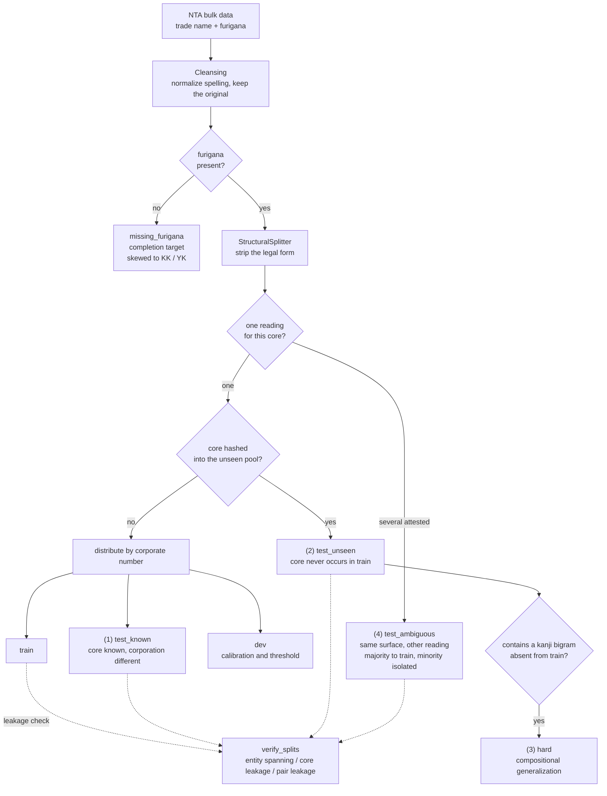
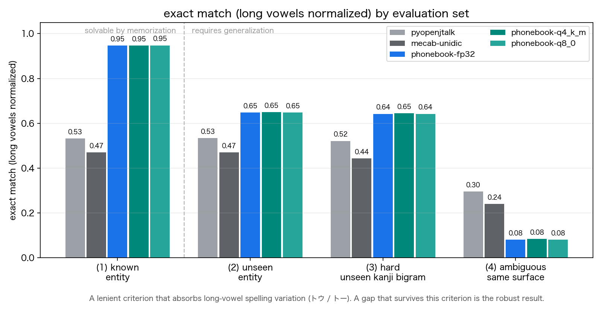
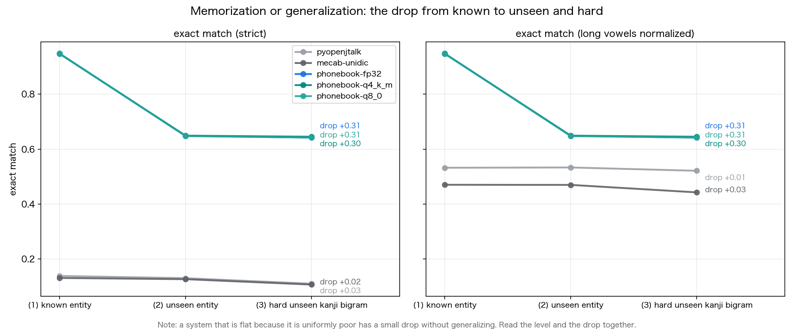

---
language:
  - ja
license: apache-2.0
library_name: phonebook
tags:
  - text2text-generation
  - grapheme-to-phoneme
  - g2p
  - japanese
  - katakana
  - named-entity
  - corporate-names
  - calibration
  - selective-prediction
  - gguf
  - onnx
datasets:
  - houjin-bangou
metrics:
  - exact_match
  - cer
---

# Phonebook — reading Japanese corporate names by structure, not by memory

**Getting the reading of "株式会社◯◯" right is easy. The hard part is the ◯◯ you have never seen.**

Phonebook is a small model (17M parameters by default, built to run on CPU) specialised
in one task: mapping a Japanese corporate name to its katakana reading. The goal is to
beat general-purpose Japanese G2P on proper nouns **under an evaluation that separates
known from unseen entities strictly enough to be believed**.

The hypothesis under test, in one sentence:

> On known corporate names Phonebook is comparable to existing methods. **The gap opens
> on unseen entities and on the hard set** — and that gap is what shows this is not
> merely memorization.

That is a hypothesis, not a conclusion. What this repository provides is an evaluation
**built so the hypothesis can be refuted**: line the numbers up per split and it is
visible to anyone whether it holds.

**In the run shipped here it does not hold.** Phonebook is far ahead on known entities
and still clearly ahead on unseen and hard ones, but the *gap narrows* rather than
widening, and calibration degrades badly on the hard and ambiguous splits. Those
negative results are written up in [Results](#results) rather than buried.

Beyond accuracy, Phonebook is built to **know how likely it is to be right**. Its
confidence is calibrated, and below a threshold it answers **"unknown"**.

---

## Three lines

```python
from phonebook import load_reader
reader = load_reader()                       # reads artifacts/model or $PHONEBOOK_MODEL
print(reader.read("株式会社日本電気", nbest=3).to_dict())
```

From the command line:

```bash
phonebook read "株式会社日本電気" --nbest 3
```

---

## What is different

| | General G2P (pyopenjtalk / MeCab+UniDic) | Large LLM (prompt only) | Phonebook |
|---|---|---|---|
| Unseen proper nouns | falls back to a generic reading when absent from the dictionary | often right | **trained and evaluated for exactly this** |
| Output character set | no guarantee | no guarantee | **constrained decoding: katakana + prolonged mark only** |
| Text that is already katakana | usually preserved | usually preserved | **structurally preserved by the copy path** |
| Confidence | none | uncalibrated | **calibrated, with rejection ("unknown")** |
| Runtime | CPU | API / GPU | **CPU only; 11 MB of weights at Q4_K_M (6.2x compression)** |

### The four components

1. **StructuralSplitter** — strips the legal form (leading or trailing, parentheses,
   shop names) with rules and assigns it a deterministic reading. Only the trade-name
   core reaches the model. This is not just about speed: it **removes from the
   evaluation the effect where memorizing カブシキガイシャ inflates the score**.
2. **CharSeq2Seq** — a small character-level Transformer encoder-decoder with a
   **pointer-generator (copy) mechanism**, so katakana and hiragana already present in
   the input can be transcribed verbatim.
3. **CalibratedNBest** — emits n-best hypotheses with sequence probabilities, turns them
   into probabilities with temperature scaling / Platt calibration, and **rejects**
   below a threshold, answering "unknown".
4. **EnglishToKatakana** — handles Latin script in trade names: lexicon, then acronym
   detection, then **Hepburn romaji detection**, then English syllable rules. (Latin
   text in Japanese company names is more often romaji than English.)

---

## The split design — the heart of the project

Reading proper nouns is a task where a sloppy split silently **measures memorization and
calls it generalization**. Phonebook keeps four sets strictly apart.



| Set | Definition | What it measures |
|---|---|---|
| (1) known entity | The trade-name core occurs in train, but **the corporate number does not** | effectively dictionary lookup |
| (2) unseen entity | The core string never occurs in train | genuine generalization |
| (3) hard | Subset of (2) containing a **kanji bigram** absent from train | compositional generalization that substring memorization cannot solve |
| (4) ambiguous | Several readings genuinely attested for one surface (日本 = ニホン / ニッポン). The minority reading is isolated | a problem with no unique answer: n-best and calibration |

The split uses a **salted deterministic hash**, not a random seed, so the same input
always reproduces the same split. If `verify_splits()` finds a leak, dataset generation
**fails and stops** — and pytest runs the same checks.

---

## Results

Full per-split tables: [`benchmarks/RESULTS.md`](benchmarks/RESULTS.md). Plots: [`figures/`](figures/).

> The numbers below were produced on the **synthetic corpus** from
> `scripts/make_synthetic.py`, which exists so the pipeline can be validated end to end
> without the NTA bulk download. They demonstrate that the machinery works; they are
> **not** evidence about real corporate names. `metadata.synthetic` in `results.json`
> marks this and `RESULTS.md` carries a warning banner.

Exact match, long vowels normalized (the fair comparison — see "On fairness" below):

| condition | (1) known | (2) unseen | (3) hard | (4) ambiguous |
|---|---:|---:|---:|---:|
| A: pyopenjtalk | 0.532 | 0.533 | 0.521 | 0.295 |
| A: MeCab+UniDic | 0.470 | 0.470 | 0.443 | 0.240 |
| B: LLM (prompt only) | not run | not run | not run | not run |
| C: Phonebook fp32 | **0.947** | **0.648** | **0.642** | 0.081 |
| D: Phonebook Q4_K_M | **0.947** | **0.649** | **0.645** | 0.083 |

Character error rate (lower is better): Phonebook 0.004 / 0.027 / 0.027 / 0.120 against
pyopenjtalk 0.144 / 0.140 / 0.143 / 0.185.

### What this run actually shows — including where the hypothesis fails

**The stated hypothesis is not confirmed by this run, and the repository says so.**

1. **The lead narrows on unseen entities; it does not widen.** Against pyopenjtalk on the
   lenient metric, Phonebook leads by **+0.415** on known entities but only **+0.115** on
   unseen and **+0.121** on hard. Phonebook's own drop from known to hard is **-0.31**,
   against **-0.01** for pyopenjtalk. Much of the advantage on known entities is
   therefore the model having seen that trade-name core. Under the reading guide below,
   that pattern is the "does not support it" row, not the "supports it" row.
2. **Phonebook is nevertheless clearly ahead in absolute terms where it matters.** On
   unseen entities it is 0.649 against 0.533, and its CER is roughly five times lower
   (0.027 against 0.140). Being ahead is not the same as the gap widening, and the two
   should not be conflated.
3. **The ambiguous set is where it is worst, by construction and in fact.** Top-1 exact
   match is 0.081, *below* pyopenjtalk's 0.295, because that split deliberately holds out
   the minority reading and the model confidently predicts the majority one. n-best@3
   covers 0.998 of the attested readings, so the right answer is present as a candidate —
   which is precisely why this split is scored by coverage and calibration rather than
   top-1.
4. **Calibration holds on known entities and breaks down elsewhere.** ECE is 0.019 on
   known, 0.274 on unseen, 0.786 on ambiguous. The confidence is trustworthy exactly
   where the answer is easy, and misleading where it is hard.
5. **Rejection does not rescue that.** The threshold fitted on dev (0.366, 95.7%
   precision there) leaves coverage at 0.99 on the test splits and so barely lifts
   precision (0.648 → 0.651 on unseen). Dev is dominated by known-entity-like cases, so
   the operating point does not transfer. **Fit the threshold on data that matches the
   deployment distribution**, not on dev.
6. **Quantization is free.** Q4_K_M matches fp32 to within ±0.003 exact match on every
   split, at 10.8 MB of weights (6.2x compression) and the same latency.

Points 1, 3, 4 and 5 are negative results. They are reported because an evaluation
designed to be refutable is worthless if the refutation is then hidden.

Regenerate everything with:

```bash
python scripts/evaluate.py --data data/processed --model artifacts/model --out benchmarks
python scripts/make_figures.py --results benchmarks/results.json --out figures
```

### How to read the results — what supports the hypothesis, what refutes it

| Observation | Meaning |
|---|---|
| Close on known, Phonebook's **lead widens** on unseen and hard | supports the hypothesis: it generalizes |
| Large lead on known, **lead narrows** on unseen and hard | **does not support it**: suspicion of memorizing the training distribution |
| The lead disappears under long-vowel normalization | the difference was notation, not knowledge |
| n-best@3 far above top-1 on hard | the right answer is being produced as a candidate; useful together with calibration |
| Large ECE, or rejection that fails to raise precision | the confidence is not usable; calibration needs work |

**A system that is flat because it is uniformly poor has a small "drop" without
generalizing.** Read the level and the drop together.

### Headline figures





| Figure | What it shows |
|---|---|
| `figures/known_vs_unseen.png` | Exact match per split (strict) |
| `figures/known_vs_unseen_phonetic.png` | The same with long vowels normalized |
| `figures/generalization_gap.png` | The drop from known → unseen → hard, strict and lenient side by side |
| `figures/reliability.png` | Confidence against empirical accuracy |
| `figures/rejection.png` | Coverage against precision on accepted items |
| `figures/speed_size.png` | CPU inference time and weight size |

Metrics reported: exact match (strict and long-vowel-normalized), CER, n-best@3
coverage, ECE, coverage and precision under rejection, ms/item and resident RSS.

**On fairness.** Existing G2P emits a *pronunciation* form (ユーゲン, ショーテン) while
the NTA furigana writes ユウゲン, ショウテン. That is a difference of notation, not of
knowledge, so a lenient exact match with long vowels normalized is reported alongside
the strict one. Legal-form reading variants (カブシキ**ガ**イシャ / カブシキ**カ**イシャ)
are normalized identically for every condition.

---

## Running the pipeline

`make all` runs the whole chain on synthetic data (generate → train → evaluate →
figures → export). For real data: `make all CSV=data/raw/00_zenkoku_all.csv ENCODING=cp932`.

```bash
pip install -e ".[all]"

# 0) Exercise the full pipeline with no data on hand (synthetic)
python scripts/make_synthetic.py --out data/raw/synthetic.csv --n 60000

# 1) Real data: read the terms of use, then fetch
python scripts/fetch_houjin.py --zip ~/Downloads/00_zenkoku_all.zip --out data/raw --accept-terms

# 2) Cleanse, split four ways, verify no leakage, build the dataset
python scripts/build_dataset.py --csv data/raw/00_zenkoku_all.csv --encoding cp932 --out data/processed
#    to the Hub: --push-to-hub <user>/phonebook-corporate-readings

# 2b) Auxiliary Latin-to-katakana pairs and lexicon (split inherited from the parent)
python scripts/build_en2kana_data.py --data data/processed --out data/processed/en2kana

# 3) Train on the trade-name core, then calibrate and pick the rejection threshold
python scripts/train.py --data data/processed --out artifacts/model --preset small --epochs 12

# 4) Evaluate (A: existing G2P, B: LLM, C: Phonebook, D: quantized)
python scripts/evaluate.py --data data/processed --model artifacts/model --out benchmarks

# 5) Figures
python scripts/make_figures.py --results benchmarks/results.json --out figures

# 6) Export (GGUF Q4_K_M / Q8_0, ONNX, MLX)
python scripts/export.py --model artifacts/model --out artifacts/export
#    to the Hub: --push-to-hub <user>/phonebook

# 7) Derived dataset: estimated readings for corporations with no furigana
python scripts/fill_missing.py --data data/processed --model artifacts/model \
    --out artifacts/derived/furigana_estimates.jsonl

# 8) Gradio demo
python app.py
```

### Ablations

```bash
# Train without the copy mechanism and see how katakana trade names change
python scripts/train.py --data data/processed --out artifacts/model-nocopy --no-copy
# Disable deterministic transcription of kana runs and rely on the copy mechanism alone
phonebook read "株式会社アルファ電子" --no-segment
```

### CLI

```bash
phonebook read "株式会社日本電気" --nbest 3            # candidates, probabilities, confidence, latency
phonebook read "株式会社日本電気" --compare            # side by side with pyopenjtalk
phonebook read "株式会社日本電気" --threshold 0.8      # below the threshold: "unknown"
phonebook split "日本電気株式会社"                     # legal form / trade-name core decomposition
phonebook info                                        # model configuration and parameter count
```

---

## About the export formats (stated plainly)

- **GGUF (Q4_K_M / Q8_0)**: the storage format defined by llama.cpp (real Q4_K / Q6_K /
  Q8_0 block structure) is implemented here and the round-trip is bit-exact. But
  Phonebook is a custom architecture llama.cpp does not know, so **llama.cpp cannot run
  these files**. GGUF is a container for distributing and inspecting weights; use
  PyTorch, ONNX or MLX to run the model.
- The scale search is the direct min/max solution rather than llama.cpp's iterative
  search, so the quantized values are not bit-identical to llama.cpp's (same format,
  marginally larger error).
- Blocking flattens the tensor instead of blocking per row, because shapes like
  d_model = 384 are not multiples of 256.
- **ONNX** runs as-is under onnxruntime; beam search runs on the host.

---

## Derived artifact: estimated readings for missing furigana

`scripts/fill_missing.py` estimates a reading for every corporation whose furigana is
unregistered and emits it **with a confidence and an accept/reject decision**, ready to
publish as a derived dataset.

**Two things to be clear about.**

1. **These are estimates, not official furigana.** They cannot be used for registration
   or any official procedure. Every row carries `is_estimate: true` and a disclaimer.
2. **The missingness is non-random.** Roughly 30–40% of Kabushiki-Kaisha and 40–50% of
   Yugen-Kaisha records lack a furigana, against under 10% for other kinds. An overall
   accuracy therefore says nothing useful about this derived data. The script
   **stratifies by (corporation kind × whether the trade-name core appeared in
   training)** and reports the expected accuracy reweighted to the composition of the
   missing set.

On the synthetic run, 4,000 missing-furigana records gave a 98.9% acceptance rate at the
dev-fitted threshold, with a naive overall accuracy of 0.825 against a stratified
expected accuracy of **0.842** — and the strata that matter are visible:

| stratum | share of the missing set | accuracy |
|---|---:|---:|
| Kabushiki-Kaisha, core seen in training | 47.9% | 0.947 |
| Kabushiki-Kaisha, core unseen | 22.2% | 0.620 |
| Yugen-Kaisha, core seen | 13.6% | 0.942 |
| Yugen-Kaisha, core unseen | 7.9% | 0.658 |

Nearly a third of the completion target sits in the "core unseen" strata, where accuracy
is around 0.62–0.66 rather than 0.94. Quoting a single overall number would hide exactly
that.

---

## Tests

```bash
pytest -q
```

The core checks all pass **without a trained model**, which is the point: they verify
design guarantees, not products of training.

- The output is katakana and the prolonged mark only (holds for a randomly initialized model)
- No corporation spans train/test; no unseen core occurs in train
- Katakana input is preserved verbatim (copy mechanism)
- The rejection threshold behaves as intended, boundary included
- The quantization storage format matches GGML's definition and round-trips bit-exactly

---

## On personal names

**Reading personal names is not the objective of this project.** There is prior work
(Namelti among others), and corporate names are a different distribution. Personal names
are kept to a **transfer experiment** via
`scripts/train.py --lora --init-from artifacts/model`.

---

## Data source and terms of use

**Source: National Tax Agency Corporate Number Publication Site
(https://www.houjin-bangou.nta.go.jp/) — created by processing that data.**

- The information published there may be used freely — reproduction, public
  transmission and adaptation included, commercial use permitted — under terms
  conforming to the Japanese Government's Public Data License (Version 1.0).
- **Crediting the source is required.** If you edit or process the data you must
  **also state that you did so**. Publishing it in a manner suggesting the government
  produced your work is prohibited.
- Always check the current terms at https://www.houjin-bangou.nta.go.jp/pc/riyokiyaku/.
  The description here reflects 2026-08 and is not the terms themselves.
- **This repository does not redistribute the raw data.** Fetch it with
  `scripts/fetch_houjin.py`.
- The furigana field (item 35 of the resource definition) is specified as "full-width
  katakana and the prolonged sound mark only", blank when unregistered.

The code is Apache-2.0.

## Disclaimer

Readings produced by this model are **estimates**, not official furigana. For the
official furigana consult the National Tax Agency Corporate Number Publication Site.
The demo uses fictitious company names; no disparagement of any real company is intended.
